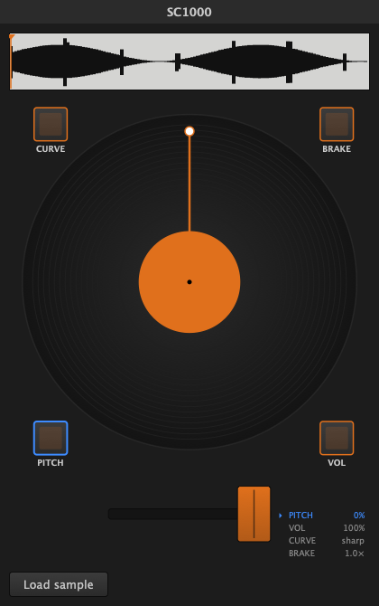

# SC1000 Midi Controller

**Drop in a sample and scratch it like vinyl** — spin the platter, cut it with the
crossfader, watch the waveform and playhead move. A macOS scratch instrument, plus
the firmware that turns a real [SC1000](https://github.com/rasteri/SC1000) into the
USB-MIDI controller that drives it.

  

SC1000 Midi Controller is **two parts that work together**:

- **The plugin** (macOS) — drop any sample onto it and scratch it like a record:
  variable-rate, reversible playback driven by a jog wheel and gated by the
  crossfader, with the spinning platter and waveform the hardware itself lacks.
  Runs as an **AU plugin** (Renoise, Logic, any AU host) or a **standalone app**.
- **The controller firmware** — turns an SC1000 hardware scratch instrument into a
  plug-and-play **USB-MIDI controller**: its jog wheel, crossfader, volume pots and
  buttons stream as MIDI over one USB cable (which also powers it — no soldering).

Use either on its own — the plugin works with any controller sending the same MIDI,
the firmware works with any MIDI software — but together they're a complete,
cable-free scratch setup.

## Features

- 🎚️ **Scratch any sample like vinyl** — reversible, variable-rate, jog-driven.
- 💿 **A spinning platter, waveform + playhead** — the visual feedback the hardware
  has no screen for.
- ✂️ **Crossfader cut** — a sharp on/off for transforms and chirps, not a mushy fade.
- 🎛️ **Cue pads, start/stop, drop-in samples** (wav / aiff / mp3 / flac).
- 💾 **Self-contained songs** — the loaded sample is saved *inside* your project, so
  nothing goes missing.
- 🍎 **AU + standalone, Apple-Silicon native.**
- 🔌 **No-solder controller firmware** — jog, crossfader, pots and buttons → USB-MIDI
  over a single cable.

## Get the plugin (macOS, Apple Silicon)

1. Download **[SC1000-AU-latest.zip](https://github.com/gherkins/sc1000-controller/raw/main/dist/SC1000-AU-latest.zip)**
   (or the **[standalone app](https://github.com/gherkins/sc1000-controller/raw/main/dist/SC1000-Standalone-latest.zip)**).
2. Unzip and drop **`SC1000.component`** into `~/Library/Audio/Plug-Ins/Components/`.
3. Open it in your AU host (or just run `SC1000.app`), **drag a sample in**, and scratch.

> In Renoise, set the **instrument's MIDI input** to your controller — *not*
> MIDI-mapping-to-parameter, which would break the relative jog (see
> [technical details](#technical-details)).

## Get the controller firmware (for a real SC1000)

> ⚠️ **Use entirely at your own risk.** This is experimental, unofficial firmware.
> It rebuilds and flashes your device's kernel, device tree and boot partition, and
> it can **brick, damage, or "fry" your SC1000 / SC500** (or anything you connect it
> to). **You alone are responsible for whatever happens to your hardware.** There is
> **no warranty of any kind** (GPLv2 §11–12). Keep the factory backup
> (`./build/make-stock.sh`) and read the recovery notes *before* you flash. If you're
> not comfortable recovering a device that won't boot, don't flash it.

1. Download **[sc1000-firmware-latest.zip](https://github.com/gherkins/sc1000-controller/raw/main/dist/sc1000-firmware-latest.zip)**
   and unzip → `xwax` + `sc.tar`.
2. Copy both onto a **FAT32 USB stick**, insert it in the SC1000's **USB-A** port.
3. **Hold a beat button** and power on → it says "updated successfully."
4. Power off, remove the stick, connect the **micro-USB** to your computer → it
   appears as a MIDI device named **`MIDI Gadget`** (a rename to "SC1000" is
   planned). Set that as the plugin's MIDI input and play.

Prefer to build it yourself? See **[firmware/README.md](firmware/README.md)**.

## How they play together

The controller streams its jog wheel as a **relative** MIDI CC (so fast reversals
never break), the crossfader and pots as CCs, and the buttons as notes. The plugin
reads that raw stream and turns the jog into playhead movement — the scratch — gated
by the crossfader cut. One USB cable carries power *and* MIDI. Full map:
**[host/sc1000-controls.md](host/sc1000-controls.md)**.

## Technical details

- **Plugin format: AU, never VST3.** VST3 normalizes incoming MIDI CC into plugin
  *parameters*, which destroys the SC1000's relative jog stream; AU and Standalone
  pass raw CC through. This is load-bearing — see
  [`vst/docs/ARCHITECTURE.md`](vst/docs/ARCHITECTURE.md).
- **Firmware**: the micro-USB port runs the A13 SoC's USB0 as a device gadget
  (`g_midi`); a custom kernel + device tree enable it and `sc_midi_out.c` (added to
  xwax) emits the controls. Built with a Dockerised buildroot.
- **Docs**: device → plugin MIDI contract
  [`vst/docs/MIDI-MAPPING.md`](vst/docs/MIDI-MAPPING.md) · plugin architecture &
  scratch DSP [`vst/docs/ARCHITECTURE.md`](vst/docs/ARCHITECTURE.md) · hardware map
  [`host/sc1000-controls.md`](host/sc1000-controls.md).
- **Build from source**: `make vst` (plugin) · `make firmware` (controller) ·
  `make help` for all tasks.

## License & credits

GPLv2 for the firmware — inherited from [xwax](https://xwax.org) (© Mark Hills) and
SC1000 (© Andrew Tait / rasteri). The plugin is built on [JUCE](https://juce.com)
(GPL), so distributed plugin binaries are GPL too. See [`COPYING`](COPYING).

_AI-transparency: created with Claude Opus 4.8._
